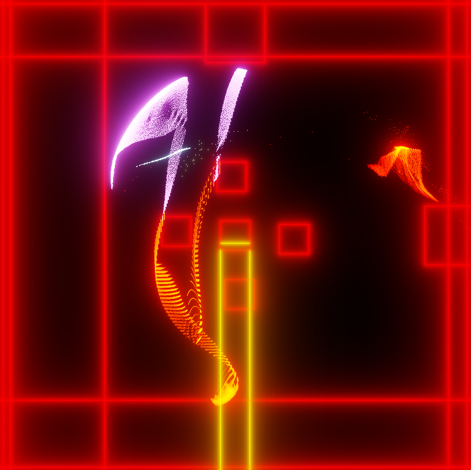

# Flocker

A game where you tend a flock of very tiny creatures.

My submission for the Ludum Dare 51 game jam.

;

## Dependencies
- CMake (meta build system)
- Dear ImGui (UI)
- EnTT (ECS library)
- Fwog (OpenGL abstraction)
- GLM (math)
- GLFW (platform abstraction)
- OpenGL 4.5 (graphics)
- Glad (OpenGL loader)

## Building

```bash
$ git clone https://github.com/JuanDiegoMontoya/LD51.git
$ cd LD51
$ mkdir build
$ cd build
$ cmake ..
```

Alternatively, the root directory can be opened in Visual Studio and its CMake integration will do everything for you. Well, it won't give you a massage or do your chores, but you get the idea.
